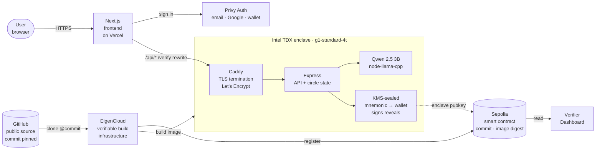

# Sealed

**Salary disclosure circles, sealed to an Intel TDX enclave.**

A small group at the same company / role / level each privately submits their compensation into a confidential-computing enclave on EigenCompute. A classifier — Qwen 2.5 3B Instruct, running inside the same enclave — validates each submission against a public rubric. Once N validated submissions accumulate, **all reveal simultaneously**, signed by a key that exists only inside the chip.

The operator (me, EigenCloud, any human) literally cannot read any submission before the threshold trips. Intel TDX enforces it in silicon. There is no privacy policy to trust.

| | |
|---|---|
| **Live demo** | https://sealed-abvaj0hy4-vcraz0r-gmailcoms-projects.vercel.app |
| **Backend (TEE)** | https://34-178-145-214.nip.io |
| **EigenCloud verifier** | https://verify-sepolia.eigencloud.xyz/app/0x01B009899E66b52CF2295b8F79C3fc4E624c0A64 |
| **Source** | https://github.com/VictorChenCA/sealed |
| **Network** | Sepolia (EigenCompute private preview) |

---

## The problem

Pay opacity costs American workers an estimated $100B/year in suppressed wages. The asymmetry isn't between you and HR — it's between you and the four other engineers at your level on your team. Levels.fyi has 750k+ disclosures, but the band tells you nothing about the conversation in your room.

That conversation never happens because whoever shares first gives everything away and learns nothing. It's a coordination failure, not a privacy problem. Existing tools (group chats, anonymous surveys) all fail the same way: someone has to read the data first.

**Sealed makes "share simultaneously, or not at all" a tractable primitive.** The platform you'd trust to mediate the reveal can't, because the silicon won't let it.

---

## What it does

1. **Create a circle**: a host defines a scope (`company / role / level / city`) and a threshold `N` (default 3).
2. **Submit privately**: each participant posts structured comp data (base, bonus, equity, vest, signing, city, notes) under a chosen pseudonym. A classifier inside the enclave validates plausibility against the public rubric and returns a verdict `{valid, score, reason}`.
3. **Wait**: while `N-1` others submit, no one — including the operator — can read any value. The status page shows progress (`2 of 3 valid`).
4. **Reveal atomically**: when the Nth validated submission lands, the enclave signs the full payload with its derived wallet and the dashboard unblurs all submissions at once. Median, p25, p75 surface alongside.
5. **Verify**: anyone can hit `/verify`, click through to GitHub / HuggingFace / Etherscan, or run `scripts/verify-locally.sh` to independently confirm the running code, the model, the rubric, and the reveal signature.

---

## Architecture



Three independent chains converge in this picture:

1. **Request chain** (left side) — user's browser hits the Vercel frontend, which proxies API calls through to the enclave's Caddy reverse proxy via Next.js rewrites. Caddy (running *inside* the TEE) terminates TLS so EigenCloud's networking infra cannot decrypt traffic. Express handles the API, calls Qwen for classification, signs reveals with the KMS-sealed wallet.
2. **Source-of-truth chain** (right side) — every deployment is built from a pinned GitHub commit by EigenCloud's own build pipeline. The `(commit_sha, image_digest)` tuple is registered on-chain at the Sepolia smart contract. Anyone can reproduce the build and confirm the digest matches.
3. **Attestation chain** — the wallet that signs reveals is derived from a mnemonic that EigenCloud's KMS releases only to the exact attested image digest. Modify the image, the mnemonic is refused. The wallet's pubkey is queryable in `/verify` and visible on Sepolia Etherscan.

An aesthetic version of this diagram lives at `docs/architecture.png` (generate from the prompt at the bottom of this README).

---

## The four-link trust chain

Every reveal is verifiable against four independent public artifacts. None require trusting the operator.

| # | Link | What you check | How |
|---|---|---|---|
| 1 | **Source matches running code** | `commit_sha` returned by `/verify` exists in the public GitHub repo | `git clone && git checkout <sha>` — read the actual code |
| 2 | **Classifier model verified** | `classifier.model_sha256` matches the Dockerfile-pinned HuggingFace revision | The Dockerfile aborts the build if the downloaded model doesn't sha256-match; HuggingFace's revision URL is immutable |
| 3 | **Rubric pinned at v1.0** | `rubric_version` matches the rubric file in the same commit | Open `src/classifier/qwen.ts` at the commit |
| 4 | **Reveal signed by enclave key** | The signature on `/api/circles/:id/reveal` verifies against `enclave_pubkey` | Standard ECDSA recover; pubkey is also Etherscan-queryable as the only wallet with this private key |

### One-liner verifier

```bash
git clone https://github.com/VictorChenCA/sealed && cd sealed
bash scripts/verify-locally.sh https://34-178-145-214.nip.io
```

That script fetches `/verify`, confirms the commit exists on GitHub, downloads the Dockerfile at that commit, extracts the pinned `MODEL_SHA256` value, and confirms the live classifier's model hash matches. Three checks, ~3 seconds.

### Manual reproduce-the-build path

```bash
curl https://34-178-145-214.nip.io/verify
# → note commit_sha

git clone https://github.com/VictorChenCA/sealed && cd sealed
git checkout <commit_sha>
docker build -t sealed:verify .
# image digest should match the on-chain record at:
# https://verify-sepolia.eigencloud.xyz/app/0x01B009899E66b52CF2295b8F79C3fc4E624c0A64
```

---

## Why TEE (and not the alternatives)

| Approach | Operator can read submissions? | Engineering cost today |
|---|---|---|
| Trust a centralized server (AWS / GCP raw) | **Yes** | Low |
| Multi-party computation | No | High; latency-prohibitive for LLM judging |
| Fully homomorphic encryption | No | Too slow for LLM inference today |
| Zero-knowledge proofs of LLM inference | No | 2-3 years from production-runnable |
| **Intel TDX in an attested enclave (Sealed)** | **No, enforced in silicon** | **Modest; this project shipped in 12 hours** |

The remaining trust assumption is Intel itself — that the TDX attestation key hasn't been extracted by a nation-state actor. EigenLayer is layering crypto-economic security on top (restaking-based slashing for misbehaving enclaves) as defense-in-depth. v1 is hardware-rooted only.

---

## Tech stack

- **Runtime**: EigenCompute (Intel TDX, `g1-standard-4t`: 4 vCPU, 16 GB)
- **Backend**: Node 22 + Express
- **Classifier**: Qwen 2.5 3B Instruct Q4_K_M (GGUF) via `node-llama-cpp`, ~2 GB weights baked into the image, sha256-verified at build time against HuggingFace's pinned revision
- **TLS**: Caddy reverse proxy inside the enclave (Let's Encrypt via HTTP-01, certs never leave the chip)
- **Signing**: Wallet derived from `MNEMONIC` sealed by EigenCompute KMS to the exact image digest
- **Frontend**: Next.js 15 App Router + TypeScript + Tailwind, deployed to Vercel
- **Auth**: Privy multi-method (email / Google / Apple / GitHub / Discord / Farcaster / wallet)
- **Chain**: Sepolia testnet; on-chain app contract at `0x01B009899E66b52CF2295b8F79C3fc4E624c0A64`
- **Build**: EigenCloud verifiable build mode — image built from `github.com/VictorChenCA/sealed` at the pinned commit, provenance signed, image digest registered on-chain

---

## Local development

```bash
# Backend
npm install
node scripts/download-model.mjs           # ~2 GB
cp .env.example .env                      # set a test MNEMONIC for local only
npm run dev                                # http://localhost:3000

# Frontend (separate)
cd frontend
cp .env.example .env.local                 # set NEXT_PUBLIC_PRIVY_APP_ID
npm install
npm run dev                                # http://localhost:3001
```

---

## Deploying to EigenCompute

```bash
ecloud compute app deploy \
  --force --name sealed --env-file .env.deploy \
  --instance-type g1-standard-4t \
  --environment sepolia \
  --log-visibility public --resource-usage-monitoring enable \
  --verifiable \
  --repo https://github.com/VictorChenCA/sealed \
  --commit $(git rev-parse HEAD) \
  --build-dockerfile Dockerfile
```

Verifiable build mode delegates the Docker build to EigenCloud's pipeline. No local Docker required. End-to-end deploy time: ~7 minutes (build + push + on-chain register + TEE provisioning + cold start).

---

## What's deliberately not solved yet

- **Sybil resistance.** Pseudonyms are free-text in v1. Roadmap: wallet-based posting (one submission per address), optional offer-letter cross-check by the classifier, or a small USDC bond per submission. The privacy guarantee (operator can't read) is independent of sybil resistance, so this is additive.
- **Classifier correctness.** Qwen 2.5 3B at Q4 is good at "is this offer plausible" — not at adversarial rubric-gaming. The rubric is public, so the bar is auditable. Upgrades to Qwen 7B (CPU-bound at current instance size) or to confidential-GPU instances will land when EigenCloud ships CC-GPU.
- **Scale-to-zero.** g1-standard-4t bills 24/7. A "warm one second after wake" tier would transform the cost profile for sporadically-used circles.
- **Cross-circle aggregates.** Sealed never produces cross-circle statistics today — by design, every reveal is bounded to one circle. A future "trusted aggregate over many circles" feature would itself need to run in the enclave with separate attestation.

---

## Try it / verify it yourself

1. Open https://sealed-abvaj0hy4-vcraz0r-gmailcoms-projects.vercel.app
2. Sign in (optional) — Privy modal supports email, Google, Apple, GitHub, Discord, wallet
3. Click into the open Google · SWE · L4 circle (or create your own)
4. Submit a disclosure — watch the 5-stage classifier loading inside the TEE
5. When the threshold trips, the reveal unblurs all submissions atomically
6. Click "See proof →" → 4 trust cards, each clickable to GitHub / HuggingFace / Etherscan
7. Or skip the UI entirely: `bash scripts/verify-locally.sh https://34-178-145-214.nip.io`

---

## Acknowledgements

Built during the EigenCloud Private Preview Demo Day program. Thanks to:
- The EigenCloud team for the verifiable-build pipeline — it's the most polished TEE DX I've used.
- Anthropic Claude Design for the UI port that landed in this commit history.
- Qwen team for shipping a 3B-parameter model that runs usefully on CPU.
- ecloud Slack helpers (Matt, Mustafa) for unblocking the sepolia TLS path.

---

## License

MIT.

---

## Architecture diagram — image-gen prompt

For a hero illustration of the diagram in `docs/architecture.png`, paste this into Midjourney, DALL-E 3, or Imagen. Image-gen models can't render arbitrary text reliably — keep the labels short (1-2 words) and accept that some text may need touching up in Figma after.

```
An ultra-clean technical system architecture diagram in the style of a Stripe
or Vercel engineering blog post. Dark slate background (#0a0a0c). Minimal,
geometric, isometric-leaning composition.

Center of the image: a rounded-rectangle "enclave" container with a subtle
teal glow border, labeled "Intel TDX" in tiny mono-spaced uppercase letters
on the top edge. Inside it, three smaller stacked tiles: "Caddy", "Express",
"Qwen". A small lock icon hovers over the enclave boundary, also in teal.

Left side: a browser window icon labeled "Vercel" with an arrow flowing
right toward the enclave. The arrow passes through a small "Privy" pill on
the way.

Right side: a GitHub octocat-style icon at top with an arrow flowing left
into a hexagonal "EigenCloud Build" node, then arrows splitting downward
into a Sepolia chain icon (small linked-cubes motif) and rightward into the
enclave's Caddy tile. A small "Verifier Dashboard" rectangle hangs off the
Sepolia node.

Bottom of the enclave: a small "Enclave Key" wallet glyph (teal accent),
with a dashed line up to the Sepolia chain icon labeled "signs reveals".

Style: thin 1.5-pixel strokes, ui-monospace labels, restrained palette of
near-black surfaces, hairline gray borders (#232329), single teal accent
color (oklch(0.82 0.11 185), roughly #5eead4) reserved only for the enclave
glow, the lock, and the wallet glyph. No gradients, no glow effects beyond
the enclave border, no 3D depth, no shadows.

Type all labels in a clean monospace font, short (max 12 chars each).
Layout balanced left-to-right with the enclave as the visual anchor.
Aspect ratio 16:9. High contrast, print-quality, suitable for embedding in
a technical README.
```

If image-gen produces garbled text, the **Mermaid diagram above** is already the canonical-correct architecture and renders natively on GitHub — feel free to use it as-is and skip the static image.
